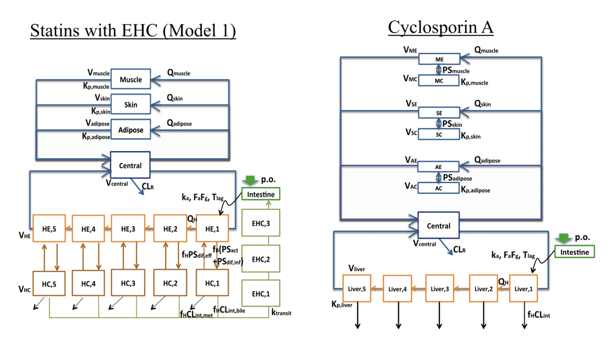

```{r, echo = FALSE, message = FALSE, warning = FALSE}
knitr::opts_chunk$set(message = FALSE)
options(mrgsolve.soloc = "build")
```


```{r, include = FALSE}
source(here::here("src/global.R"))
library(mrgsolve)
library(tidyverse)
library(knitr)
library(lattice)

```

```{r setup, echo = FALSE, message = FALSE}
mod <- mread_cache("pk1", modlib()) %>% 
  update(end = 192, delta = 0.2) %>% Req(CP)
data(exidata)
data <- filter(exidata, ID <= 10)
set.seed(1222)
```

# Introduction

## Pharmacokinetics

```{r, echo = FALSE}
mod %>% ev(amt = 100) %>% mrgsim(end = 72) %>% plot()
```

* Compartmental models
* Models with analytical solutions


## Dosing regimens

```{r, echo = FALSE}
mod %>% ev(amt = 100, ii = 24, addl = 4) %>% mrgsim() %>% plot()
```

## Dosing regimens

```{r, echo = FALSE}
e1 <- ev(amt = 100, ii = 24, addl = 9)
e2 <- ev(amt = 50, ii = 12, addl = 19)
e <- seq(e1,e2,e1)
mod %>% ev(e) %>% mrgsim(end=248*3+96) %>% plot()
```


## Population simulation

```{r, echo = FALSE, message=FALSE}
mod <- mread_cache("popex", modlib()) %>% Req(DV)
data <- expand.ev(amt = 300, ii = 24, addl = 4, ID = seq(20))
mod %>% data_set(data) %>% mrgsim() %>% plot()
```

## PKPD

```{r, echo = FALSE}
omod <- mread("opg", here("model")) %>% 
                update(end = 24*14) %>% zero_re(sigma)

odat <- ev(amt = 210) %>% ev_rep(ID = seq(100))
out <- mrgsim(omod, data = odat) %>% mutate_sims(week=time/24/7)
plot(out,PKDV+dNTX ~ week)

# out %>% as_tibble() %>% filter(week==2) %>% summarise(Median_CFB = median(dNTX))
```

## Sensitivity analysis

```{r, echo = FALSE}
idata <- tibble(VC = c(20,60,180))
hmod <- mrgsolve:::house() %>% Req(DV,RESP) %>% update(end = 244)
hmod %>% mrgsim(idata = idata,  end = 24*28, delta = 0.1,
                events = ev(amt = 100, ii = 24, addl = 28)) %>%
  plot(DV~.)
```


## Mechanistic models

```{r, echo = FALSE}
#| message: false
#| warning: false
#| echo: false
mod <- mread_cache("conway", here("model"))
e <- ev(amt = 1, evid = 8, time = 180) + ev(amt = 0, evid = 8, time = 2.5*365)
idata <- tibble(L_0 = c(1,3,5,7,10))
out <- mrgsim(mod, events = e, idata = idata, end = 6*365, delta = 1)
out@data <- mutate(out@data, time = time - 180)
plot(out, logV+L~(time/365), xlab = "Time (year)")
```


## PBPK


Yoshikado T et al. Quantitative Analyses of Hepatic OATP-Mediated
Interactions Between Statins and Inhibitors Using PBPK Modeling With a Parameter 
Optimization Method. Clin Pharmacol Ther. 2016 Nov;100(5):513-523. 
PubMed PMID: 27170342.




```{r}
#| echo: false
#| warning: false
theme_set(theme_bw() + theme(legend.position = "top"))
mod <- mread_cache(here("model/yoshikado.cpp"))
csa <- ev(amt = 2000, cmt = 2)
pit <- ev(amt = 30, cmt = 1, time = 0.5) %>% mutate(regimen = "Statin")
ddi <- seq(csa, pit) %>% mutate(regimen = "CsA + Statin")

data <- as_data_set(pit, ddi)

out <- mrgsim_df(mod, data, end = 8, delta = 0.1, add = 0.5, 
                 recover = "regimen")

ggplot(out, aes(time, CP, color = regimen)) + geom_line(lwd = 1) + 
    scale_y_log10() + scale_color_brewer(palette = "Dark2", name = "") + 
  ylab("Concentration (ng/mL)") + xlab("Time (hours)")
```

## What else?

- Parameter estimation (not hierarchical models)
- Optimal design
- Sensitivity analysis (local and global)
- Shiny apps
- Adaptive dosing
- Unusual computation


## About `mrgsolve` 

- `R` package for simulation from ODE-based models
    - Free, OpenSource, GitHub, CRAN
- Language
    - Models written in `C++` inside model specification format
    - General purpose solver: `ODEPACK` / `DLSODA` (`FORTRAN`)
        - Automatically detect and switch between non-stiff (Adams) and stiff (BDF)
          methods for solving the differential equations
    - Simulation workflow in `R`
- Hierarchical (population) simulation
    - `ID`, $\eta$, $\varepsilon$
- Integrated PK functionality
    - Bolus, infusion, `F`, `ALAG`, `SS` etc, handled under the hood
    - 1- and 2-cmt PK models in closed-form
- Extensible using `R`, `C++`, `Rcpp`, `boost`, `RcppArmadillo`
- `R` is it's natural habitat

### `mrgsolve` started as `QSP` modeling tool {.unnumbered}
- Motivation: large bone/mineral homeostasis model (CaBone)
- History using
    - Berkeley Madonna
    - WinBUGS
    - NONMEM (attempted)
- 2010: write `R` front end to `deSolve`
- 2012: write `C++` interface to `DLSODA`
- Develop dosing / event capability
- More recently, expose functionality provided by
    - `Rcpp` - vectors, matrices, functions, environments, random numbers 
    - `boost` - numerical tools in `C++`
    - users' own `C++` code (functions, data structures, classes)
- Translator from `SBML` to `mrgsolve` using `R` bindings to `libSBML`   

## Like NONMEM but not exactly

There are several features in `mrgsolve` that have been patterned
after NONMEM. 

But `mrgsolve` is _not_ a clone of NONMEM. 


## Resources

- <https://CRAN.R-project.org/package=mrgsolve>

- GitHub site: <https://github.com/metrumresearchgroup/mrgsolve>

- Discussion: <https://github.com/metrumresearchgroup/mrgsolve/discussions>

- Bug reports: <https://github.com/metrumresearchgroup/mrgsolve/issues>

- `mrgsolve` website: <https://mrgsolve.org>

- User Guide: <https://mrgsolve.github.io/user_guide>

- Blog: <https://mrgsolve.org/blog>

- Vignettes: <https://mrgsolve.org/vignettes>


## Additional packages of interest

- Sensitivity analysis: <https://github.com/kylebaron/mrgsim.sa>

- Manage large outputs: <https://github.com/metrumresearchgroup/paquet>
